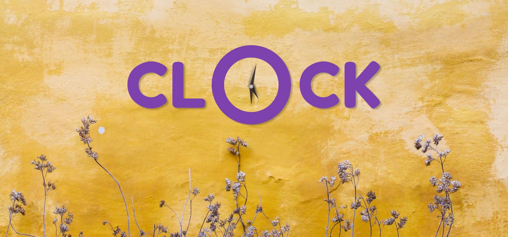

# Clock

This is the 2nd project from the JavaScript30: 30 Day Vanilla JS Challenge

## Functionality

The Clock shows the current time with a slight transition effect happening as the hour, minute and seconds hands move.

## Technologies Used

Technologies used in this project are HTML, CSS and vanilla JavaScript

## Link

- [Live Site URL](https://clock-javascript30.netlify.app/)

## Screenshot

