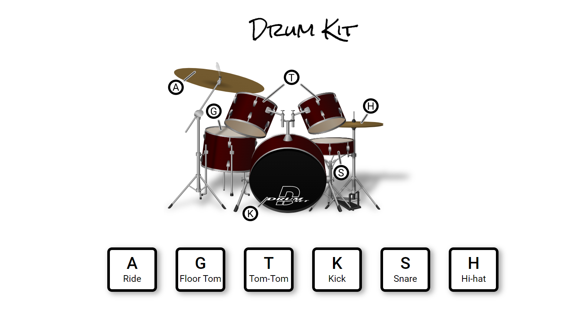

# Drum Kit

This is the first project from the JavaScript30: 30 Day Vanilla JS Challenge

Here, when a user presses a particular keyboard key, a particular part of the drum plays the audio and a transition effect takes place.

## Technologies Used

Technologies used in this project are HTML, CSS and vanilla Javascript

## Link

- Live Site URL: [Live Site URL] (https://drum-kit-javascript30.netlify.app/)

## Screenshot

